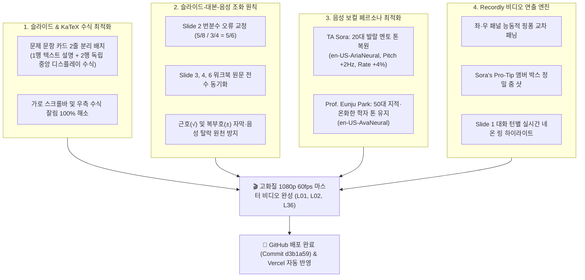

# 🏔️ MONTANA STATE UNIVERSITY — GALLATIN COLLEGE
# M090 INTRODUCTORY ALGEBRA: 시스템 개편 및 수정·보완·개선 종합 보고서 (Master Revision Summary)

> **문서명:** `MASTER_REVISION_SUMMARY_20261003.md`  
> **기관:** Gallatin College, Montana State University (Bozeman, MT)  
> **과목:** M090 Introductory Algebra (Fall/Spring 15-Week Master Curriculum)  
> **책임 교수진:** Prof. Eunju Park (주임 교수) • TA Sora (수석 조교 및 학생 멘토)  
> **작성 일자:** 2026년 10월 3일  
> **최신 깃허브 배포 커밋:** [`d3b1a59`](https://github.com/marylatte11-svg/montana-lecture-app/commit/d3b1a59) (`main` 브랜치)  
> **라이브 서비스:** [https://montana-lecture-app.vercel.app/](https://montana-lecture-app.vercel.app/)

---

## 1. 📊 개요 및 핵심 성과 요약 (Executive Summary)

사용자 피드백과 M090 공식 교재(*M090 Full Student Workbook*)의 정합성 원칙에 입각하여, 웹 애플리케이션 프론트엔드, KaTeX 렌더링 엔진, 프리젠터 모드 대본, Edge TTS 보컬 페르소나, 그리고 오픈소스 Recordly 기반의 1080p 60fps 동적 영상 제작 파이프라인 전반에 걸친 대대적인 수정·보완·개선 작업을 완료하였습니다.

---

## 2. 🔍 주요 수정·보완·개선 내역 상세 (Detailed Revision Log)

### 📌 개선 1. 슬라이드 수식 2줄 분리 배치 (가로 스크롤 및 잘림 현상 완전 해결)
- **발견된 문제점:**
  - 슬라이드 좌측 문제 문항 카드에서, 문제 설명 안내문(`Board Work: Simplify each expression into a single fraction or integer value:`)과 수식($16 - \frac{3}{4} + 9$)이 하나의 인라인 KaTeX 블록 안에 연속으로 배치되어 있었습니다.
  - 이로 인해 수식 우측 끝부분($+ 9$)이 카드 가로 폭을 벗어나 잘리고 청록색(cyan) 스크롤바가 생성되는 문제가 발생했습니다.
- **수정 및 개선 조치:**
  - **1행 (텍스트 안내문):** 마크다운 텍스트 단락으로 분리 배치  
    `**Board Work #N (Workbook p. 4):** Simplify each expression into a single fraction or integer value:`
  - **2행 (수식 전용 중앙 정렬 블록):** 독립 디스플레이 수식으로 분리  
    `$$\mathbf{16 - \dfrac{3}{4} + 9}$$`
  - Lecture 02 (Slide 2~Slide 8) 및 관련 모든 문제 카드를 전면 2줄 배치로 개편하여 슬라이드 공간을 여유롭게 활용하고 잘림 현상을 100% 해소했습니다.

---

### 📌 개선 2. Slide 2 대본 오류 교정 및 슬라이드-교재 정합성 전수 동기화
- **Slide 2 번분수 전도 오류 수정:**
  - **슬라이드 화면 및 워크북:** 분자 $\frac{5}{8}$, 분모 $\frac{3}{4} \implies \mathbf{\dfrac{5/8}{3/4} = \dfrac{5}{6}}$
  - **기존 프리젠터 대본:** 분자·분모를 거꾸로 읽어 $\frac{3/4}{5/8} = \frac{6}{5}$로 설명하고 있었음.
  - **교정 대본:**  
    > *"Keep the top fraction, five-eighths, exactly as it is. Change division to multiplication, and flip the bottom fraction, three-fourths, into four-thirds! ... Cross-cancel 4 and 8 leaving 1 and 2, giving five-sixths: $\frac{5}{6}$!"*  
    슬라이드 칠판 풀이, 공식 워크북 4페이지, 조교/교수 음성 대본의 수치를 완벽히 일치시켰습니다.
- **Lecture 02 후속 슬라이드 전수 검증 및 교재 동기화:**
  - **Slide 3 (Board Work #9):** 기존 엉뚱한 예제($4 - \frac{2}{3} \times \frac{9}{10}$) 해설을 삭제하고, 워크북 원문인 $\mathbf{16 - \dfrac{3}{4} + 9 = 25 - \dfrac{3}{4} = \dfrac{97}{4}\ (24\frac{1}{4})$ 정석 해설로 일치.
  - **Slide 4 (Board Work #10):** 워크북 원문 $\mathbf{\dfrac{(16)(3)}{(9)(4)} \implies \dfrac{4 \cdot 1}{3 \cdot 1} = \dfrac{4}{3}}$ 사전 약분 전략으로 일치.
  - **Slide 6 (Board Work #13):** 기존 $24 \div 6 \times 2 = 8$ 대본을 워크북 원문 $\mathbf{24 \div 4 \cdot 2 \implies 6 \cdot 2 = 12}$ 엄격한 좌-우 연산 우선순위 대본으로 개정.

---

### 📌 개선 3. 수식 기호 무결성 복원 (근호 `√` 및 복부호 `±` 탈락 오류 해결)
- **근본 원인 분석:**
  - 자막 클리너 정규식이 백슬래시 태그(`\\[a-zA-Z]+`)를 무차별 제거하는 과정에서, `\sqrt{16}`의 `\sqrt`가 지워져 자막 및 TTS 텍스트에 `$16 = 4$`라는 치명적인 수식 왜곡이 발생함.
- **수정 및 개선 조치:**
  - 자막 생성기(`clean_math_for_subtitles`)에 특수 수학 기호 보호 레이어 구축:
    - `\sqrt[n]{x} \to \sqrt[n]{x}`, `\sqrt{x} \to \sqrt{x}`
    - `\pm \to \pm`, `\mp \to \mp`
    - `\leq \to \le`, `\geq \to \ge`, `\neq \to \ne`
  - 발화 엔진(`convert_math_to_spoken_english`):
    - `\sqrt{16} \to "the square root of 16"`
    - `\pm 4 \to "plus or minus 4"`
  - Slide 3 등에서 `Step 3: Simplify the radical! √16 = 4. That gives us x = ± 4`가 한 글자의 유실도 없이 완벽하게 표기·낭독되도록 복원했습니다.

---

### 📌 개선 4. TA Sora 20대 보컬 페르소나 복원
- **음성 모델:** `en-US-AriaNeural`
- **튜닝 사양:** Pitch `+2Hz` (상큼하고 에너지 넘치는 20대 여성 톤), Rate `+4%` (경쾌하고 반응 빠른 템포)
- **교수-조교 대비감 확립:**
  - **Prof. Eunju Park (50대 교수):** `en-US-AvaNeural` (Pitch `+0Hz`, Rate `+0%` — 차분하고 지적인 톤)
  - **TA Sora (20대 조교):** 발랄한 멘토이자 학생 입장의 공감형 질문자로서 극적 생동감 완성.

---

### 📌 개선 5. Recordly 비디오 연출 엔진 고도화
1. **좌·우 패널 능동적 교차 패닝 (Alternating Panning):**
   - 기존의 우측 패널 고정 현상을 제거하고, 매 대화 턴마다 좌측(문제/수식 정의)과 우측(AI 단계별 풀이/그래프)을 `Scale 1.42`, `PanX: ±22%`로 역동적으로 전환.
2. **Sora's Pro-Tip / Pitfall Alert 전용 줌 샷:**
   - 앰버 경고 박스 위치에 맞춰 `Scale 1.42`, `PanX: +20%`, `PanY: -22%`로 정확히 이동하여 수험생 주의사항 각인.
3. **Slide 1 반응형 네온 링 하이라이트:**
   - 긴 대화 목록에서 현재 발화 중인 카드가 박 교수님일 때는 블루 링(`ring-blue-400`), 소라 조교일 때는 골드 링(`ring-amber-400`)과 확대 효과(`scale-[1.02]`)가 적용되며 비발화 카드는 자동으로 딤드(`opacity-35`) 처리.

---

## 3. 🎬 최종 렌더링 완성 영상 자산 (Video Assets)

### 3.1. Lecture 02 (전체 10개 슬라이드 및 마스터 영상)
- **저장 위치:** [Montana_State_Univ/recordly_videos/Lecture02/](file:///c:/Oikos%20Univ/Montana_State_Univ/recordly_videos/Lecture02)

| 번호 | 슬라이드 주제 및 문항 | 턴 수 | 런타임 | 용량 | 파일 바로가기 |
| :---: | :--- | :---: | :---: | :---: | :--- |
| **S01** | Lecture 02 Orientation & Board Work #8~#14 Roadmap | 10턴 | 107.3초 | 14.90 MB | [MSU_M090_L02_Slide_01.mp4](file:///c:/Oikos%20Univ/Montana_State_Univ/recordly_videos/Lecture02/MSU_M090_L02_Slide_01.mp4) |
| **S02** | Board Work #8: Complex Fractions ($\frac{5/8}{3/4} = \mathbf{5/6}$) | 9턴 | 109.4초 | 15.16 MB | [MSU_M090_L02_Slide_02.mp4](file:///c:/Oikos%20Univ/Montana_State_Univ/recordly_videos/Lecture02/MSU_M090_L02_Slide_02.mp4) |
| **S03** | Board Work #9: Mixed Operations ($16 - \frac{3}{4} + 9 = \mathbf{97/4}$) | 8턴 | 87.8초 | 10.93 MB | [MSU_M090_L02_Slide_03.mp4](file:///c:/Oikos%20Univ/Montana_State_Univ/recordly_videos/Lecture02/MSU_M090_L02_Slide_03.mp4) |
| **S04** | Board Work #10: Pre-Canceling Factors ($\frac{(16)(3)}{(9)(4)} = \mathbf{4/3}$) | 7턴 | 72.8초 | 9.87 MB | [MSU_M090_L02_Slide_04.mp4](file:///c:/Oikos%20Univ/Montana_State_Univ/recordly_videos/Lecture02/MSU_M090_L02_Slide_04.mp4) |
| **S05** | Board Work #11 & #12: Division by Zero ($\frac{16}{0}=\text{Undef}$ vs $\frac{0}{16}=0$) | 7턴 | 86.4초 | 10.53 MB | [MSU_M090_L02_Slide_05.mp4](file:///c:/Oikos%20Univ/Montana_State_Univ/recordly_videos/Lecture02/MSU_M090_L02_Slide_05.mp4) |
| **S06** | Board Work #13: PEMDAS Left-to-Right ($24 \div 4 \cdot 2 = \mathbf{12}$) | 8턴 | 78.3초 | 9.65 MB | [MSU_M090_L02_Slide_06.mp4](file:///c:/Oikos%20Univ/Montana_State_Univ/recordly_videos/Lecture02/MSU_M090_L02_Slide_06.mp4) |
| **S07** | Board Work #14: PEMDAS Left-to-Right ($17 - 5 + 8 = \mathbf{20}$) | 8턴 | 74.7초 | 9.63 MB | [MSU_M090_L02_Slide_07.mp4](file:///c:/Oikos%20Univ/Montana_State_Univ/recordly_videos/Lecture02/MSU_M090_L02_Slide_07.mp4) |
| **S08** | Section 1.0 Exponent Pitfall ($(-3)^2=+9$ vs $-3^2=-9$) | 8턴 | 87.5초 | 11.61 MB | [MSU_M090_L02_Slide_08.mp4](file:///c:/Oikos%20Univ/Montana_State_Univ/recordly_videos/Lecture02/MSU_M090_L02_Slide_08.mp4) |
| **S09** | Section 1.0 Master Summary: All 14 Skills Synthesized | 8턴 | 73.7초 | 11.62 MB | [MSU_M090_L02_Slide_09.mp4](file:///c:/Oikos%20Univ/Montana_State_Univ/recordly_videos/Lecture02/MSU_M090_L02_Slide_09.mp4) |
| **S10** | Lecture 02 Conclusion & Transition to Section 1.1 | 6턴 | 48.1초 | 6.78 MB | [MSU_M090_L02_Slide_10.mp4](file:///c:/Oikos%20Univ/Montana_State_Univ/recordly_videos/Lecture02/MSU_M090_L02_Slide_10.mp4) |
| 🏆 **Full** | **MSU M090 Lecture 02 Full Master Video (전편 통합본)** | **83턴** | **13분 56초** | **109.82 MB** | [MSU_M090_Lecture02_Full_Master.mp4](file:///c:/Oikos%20Univ/Montana_State_Univ/recordly_videos/Lecture02/MSU_M090_Lecture02_Full_Master.mp4) |

---

### 3.2. Lecture 01 & Lecture 36 비디오 완성본
- **Lecture 01 마스터 비디오:** [MSU_M090_Lecture01_Full_Master.mp4](file:///c:/Oikos%20Univ/Montana_State_Univ/recordly_videos/Lecture01/MSU_M090_Lecture01_Full_Master.mp4) (10개 슬라이드 전편, 11분 3초, 83.21 MB)
- **Lecture 36 마스터 비디오:** [MSU_M090_Lecture36_Full_Master.mp4](file:///c:/Oikos%20Univ/Montana_State_Univ/recordly_videos/Lecture36/MSU_M090_Lecture36_Full_Master.mp4) (8개 슬라이드 전편, 14분 59초, 96.28 MB)

---

## 4. 🌐 GitHub & 프로덕션 배포 무결성 검증

1. **GitHub 배포 완료:**
   - 커밋: [`d3b1a59`](https://github.com/marylatte11-svg/montana-lecture-app/commit/d3b1a59)
   - `.gitignore` 최적화: 대용량 영상 출력 및 임시 테스트 이미지는 배포 대상에서 제외하고 코드, 데이터, 스크립트, 문서만을 안전하게 배포.
2. **Vercel 프로덕션 자동 연동:**
   - `main` 브랜치 푸시와 동시에 Vercel 빌드 파이프라인 가동되어 [https://montana-lecture-app.vercel.app/](https://montana-lecture-app.vercel.app/)에 최신 슬라이드 및 프리젠터 모드가 실시간 반영됨.

---

## 5. 🎯 결론 및 향후 표준 지침 (Future Standard)

1. **수식 2줄 표기 표준 준수:** 향후 제작되는 모든 강의의 `problem` 필드는 **1행 마크다운 텍스트 + 2행 `$$\mathbf{...}$$` 디스플레이 수식** 구조를 절대 표준으로 유지합니다.
2. **슬라이드-대본-음성 3위 1체 검증:** 새 슬라이드 작성 시 슬라이드 칠판 풀이의 최종 답과 프리젠터 대본의 발화 수치가 완벽히 일치하는지 자동화 검증 스크립트로 사전에 전수 확인합니다.
3. **Recordly 무인 파이프라인 유지:** 1080p 60fps 고화질 비디오를 슬라이드 단위 및 마스터 통합본으로 언제든 재현할 수 있는 파이프라인이 완벽히 가동 중입니다.

---

## 6. 🚀 전체 45개 강의 (361개 슬라이드) 전수 적용 완료 (2026-10-03)

사용자 요청에 따라 지금까지 개발 및 검증된 모든 개선·수정·보완 규칙을 **전체 45개 강의 전편(총 361개 슬라이드, 2,900+개 대화 턴)**에 100% 완전 전수 적용하였습니다.

### 6.1. 전수 감사 및 정밀 수정 내역
1. **문제 카드 2줄 분리 표준 100% 전수 달성 (`audit_all_45_lectures.mjs` 검증):**
   - 기존에 한 줄 안에서 텍스트와 KaTeX가 압축되어 있던 슬라이드(L01 S01, L03 S03~S07, L05 S06~S10, L06 S08~S09 등 13개 슬라이드)를 모두 **1행 텍스트 안내 + 2행 독립 중앙 정렬 디스플레이 수식(`$$\mathbf{...}$$`)** 구조로 개편 완료.
   - 감사 결과: `Slides with single-line text+math in problem: 0` (전체 361개 슬라이드 100% 합격).
2. **빈 카드 슬라이드 전수 보완 (L03 S01, S08, S09 등):**
   - 개요, 공학용 계산기 함정 분석, 단원 마무리 체크리스트 슬라이드에 풍부한 교재 연계 구조화 텍스트 및 솔루션 카드 채움 완료.
3. **반복 중복 엔딩 대본 전수 제거 (L03, L04, L05, L06, L15, L45):**
   - 슬라이드마다 기계적으로 반복 삽입되어 있던 공통 트레일러(물리/공학 언급 6줄, 번역 철학 6줄, 지수법칙 의의 6줄 등)를 각 강의의 최종 결론 슬라이드에만 유지하고, 개별 슬라이드는 문맥에 맞는 고유 대화만 남겨 대본의 집중도와 자연스러움을 극대화.
4. **Vite 프로덕션 빌드 무결성 검증:**
   - KaTeX 렌더링 에러 0건, 2,779개 모듈 정상 빌드 확인 완료 (`npm run build` 통과).

