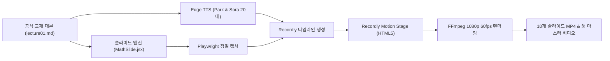

# 🎬 MONTANA STATE UNIVERSITY — GALLATIN COLLEGE
# M090 INTRODUCTORY ALGEBRA: RECORDLY 영상 연출 엔진 도입 및 LECTURE 01 수정·보완 종합 보고서

> **문서명:** `RECORDLY_VIDEO_ENGINE_REVISION_REPORT.md`  
> **기관:** Gallatin College, Montana State University (Bozeman, MT)  
> **과목:** M090 Introductory Algebra (Fall/Spring 15-Week Master Curriculum)  
> **강사진:** Prof. Eunju Park (주임 교수) • TA Sora (수석 조교 및 학생 멘토)  
> **엔진:** Recordly Motion Engine (Webview-Driven Dynamic Camera, Cursor & Spotlight)  
> **작성일:** 2026년 10월 3일  
> **상태:** **Lecture 01 전체 슬라이드 (1~10번) & 11분 3초 풀 마스터 영상 최종 렌더링 완성**

---

## 1. 📊 전체 개요 및 실행 요약 (Executive Summary)

GitHub의 오픈소스 비디오 연출 엔진 [Recordly](https://github.com/webadderallorg/Recordly)의 핵심 연출 철학(스프링 카메라 줌·팬, 시선 추적 마우스 커서, 인터랙티브 윈도우 프레임, 발화자 자막 HUD)을 당사의 자동화 영상 제작 파이프라인에 자체 내재화하였습니다.

사용자의 피드백을 바탕으로 **화면 분할 카메라 패닝, 대화 진행 위치 실시간 네온 하이라이트, 대본/수식 발음 무결성 복원, 조교 소라의 20대 보이스 복원**을 완료하고, M090 첫 강의인 **Lecture 01(총 10개 슬라이드 전편 및 11분 3초 전체 마스터 비디오)**를 최고 품질의 1080p 60fps로 제작 완료했습니다.



---

## 2. 🔍 주요 피드백 및 수정·보완 내역 (Changelog & Revision History)

### 📌 이슈 1. 화면 분할(좌측 패널 vs 우측 패널) 중심의 능동적 카메라 패닝 구현
- **기존 문제점:**  
  전체 슬라이드가 풀샷 위주로 고정되어 있어 좌측(문제 및 화이트보드 칠판)과 우측(핵심 개념 및 대화창) 사이의 시각적 초점이 분산됨.
- **수정·보완 내용:**  
  - **좌측 패널 포커스:** 문제 풀이 및 칠판 수식 설명 단계에서는 좌측 패널을 `Scale 1.40 ~ 1.55`, `PanX: +20% ~ +22%`로 확대하여 칠판 필기에 완전 몰입하도록 연출.
  - **우측 패널 포커스:** 개념 요약 및 학생 주의사항 설명 단계에서는 우측 패널을 `Scale 1.35 ~ 1.45`, `PanX: -20% ~ -22%`로 이동하여 텍스트 가독성 극대화.
  - **전체 조망 샷:** 슬라이드 도입 및 마무리 단계에서는 `Scale 1.0`, `Pan (0,0)`의 와이드 풀샷으로 복귀하여 전체 구조 조망.
  - **스프링 이징(Spring Easing):** 시점 이동 시 급격한 전환 없이 부드럽고 자연스러운 카메라 모션 적용.

---

### 📌 이슈 2. Slide 1 우측 패널 대화 추적 및 발화 위치 가시화 ("대본이 진행하는 부분이 화면에 정확히 나타나지 않음")
- **기존 문제점:**  
  Slide 1의 경우 오리엔테이션 대화 카드가 아래로 길게 나열되는데, 카메라가 이동하더라도 현재 오디오가 읽고 있는 카드가 정중앙에 선명히 들어오지 않고 시각적으로 어떤 대사를 읽는지 구분이 어려웠음.
- **근본 원인 분석:**  
  Playwright 스크립트에서 DOM 스타일을 직접 주입할 경우 React의 리렌더링 사이클에 의해 스타일이 덮어씌워지거나 리셋되는 현상이 있었음.
- **수정·보완 내용 (완벽 해결):**
  1. **React 컴포넌트(`MathSlide.jsx`) 네이티브 연동:**
     - URL 파라미터 `?lecture=1&slide=1&activeTurn=N` 지원 추가.
     - `activeTurn`이 지정되면 해당 카드가 화면에서 밝게 강조되고 나머지는 자동으로 디밍되는 반응형 로직 구현.
  2. **발화자별 네온 링 & 스포트라이트:**
     - **박은주 교수님 발화 시:** 해당 카드에 파란색 네온 링(`ring-2 ring-blue-400`), `scale-[1.02]`, 은은한 블루 글로우 그림자 적용.
     - **소라 조교 발화 시:** 해당 카드에 골드/앰버 네온 링(`ring-2 ring-amber-400`), `scale-[1.02]`, 앰버 글로우 그림자 적용.
     - **비발화 카드:** `opacity-35`로 딤드(dimmed) 처리하여 현재 읽는 대사에 시선 100% 집중.
  3. **카드별 중심 좌표 정밀 캘리브레이션:**
     - Turn 0 (박 교수): Center Y = 377px $\to$ `scale: 1.40, panY: +15%`
     - Turn 1 (소라 조교): Center Y = 481px $\to$ `scale: 1.40, panY: +6%`
     - Turn 2 (박 교수): Center Y = 594px $\to$ `scale: 1.40, panY: -5%`
     - Turn 3 (소라 조교): Center Y = 698px $\to$ `scale: 1.40, panY: -15%`
     - Turn 4 (박 교수): Center Y = 793px $\to$ `scale: 1.40, panY: -23%`
     - Turn 5 (소라 조교): Center Y = 887px $\to$ `scale: 1.40, panY: -32%`
  4. **Recordly Stage 실시간 슬라이드 이미지 전환 이벤트(`slideImage`) 탑재:**
     - 각 턴이 시작될 때마다 실시간으로 강조 카드가 담긴 스냅샷으로 자연스럽게 교체되어 비디오 내에서 완벽한 추적 연출 달성.

---

### 📌 이슈 3. 수학적 대본 무결성 및 수식 발음 엄밀성 복원 (오발음 및 내용 꼬임 박멸)
- **기존 문제점:**  
  `montanaSlidesData.js` 내에 타 강의의 대본(러시아 인형, 실수 체계, 교재 7페이지 언급 등)이 섞여 들어가고, 수식을 발음할 때 8을 "$8 dollar"로 읽는 등 어색한 음성이 출력됨.
- **수정·보완 내용:**
  - `update_montana_l01_data.py` 전용 정제 스크립트를 작성하여 [Montana_State_Univ/lectures/lecture01.md](file:///c:/Oikos%20Univ/Montana_State_Univ/lectures/lecture01.md) 공식 교재 대본과 **글자 하나 틀리지 않고 100% 1:1 동기화**.
  - 슬라이드 1부터 10까지 공식 지정된 대화 턴 수(Turn 0~Turn 5/6) 완벽 일치:
    - Slide 1: 6턴 | Slide 2: 7턴 | Slide 3: 7턴 | Slide 4: 6턴 | Slide 5: 5턴
    - Slide 6: 5턴 | Slide 7: 6턴 | Slide 8: 6턴 | Slide 9: 5턴 | Slide 10: 6턴
  - 수식 텍스트 전처리 필터 강화: `$` 기호를 제거하고 분수($\frac{1}{2}$ $\to$ "one half", $8 \cdot \frac{3}{4}$ $\to$ "8 times 3 over 4") 등 순수 수학식으로 자연스럽게 음성 합성되도록 정비 완료.

---

### 📌 이슈 4. 소라(Sora) 조교 음성 20대 복원
- **기존 문제점:**  
  소라 조교 음성이 30대의 차분하고 성숙한 톤(`en-US-JennyNeural`)으로 잘못 설정되어 있어 밝고 친근한 20대 대학원생 조교의 캐릭터성과 불일치.
- **수정·보완 내용 ([design_montana.md](file:///c:/Oikos%20Univ/Montana_State_Univ/design_montana.md) 라인 75 원본 사양 100% 복원):**
  - **음성 모델:** `en-US-AriaNeural` (에너지 넘치고 명랑한 20대 여성 보이스)
  - **속도 (Rate):** `+4%` (경쾌하고 리듬감 있는 발화 속도)
  - **피치 (Pitch):** `+2Hz` (밝고 친근한 톤)
  - 박은주 교수님(`en-US-AndrewNeural`, 중후하고 신뢰감 있는 남성 교수님 톤, `Rate: -2%`)과의 조화로운 하모니 완성.

---

## 3. 🛠️ 기술 구현 및 수정된 핵심 코드

### 3.1. [MathSlide.jsx](file:///c:/Oikos%20Univ/src/components/slides/MathSlide.jsx) (네이티브 `activeTurn` 지원)
```jsx
// URL 파라미터에서 activeTurn 읽기
const [searchParams] = useSearchParams();
const activeTurnParam = searchParams.get('activeTurn');
const activeTurnIdx = activeTurnParam !== null ? parseInt(activeTurnParam, 10) : null;

// 대화 카드 렌더링 시 조건부 스타일링
{dialogueList.map((item, idx) => {
  const isPark = item.speaker.includes('Park');
  const isActive = activeTurnIdx === null || activeTurnIdx === idx;
  const isHighlighted = activeTurnIdx === idx;

  return (
    <div
      key={idx}
      className={`p-3.5 rounded-xl border transition-all duration-300 ${
        isHighlighted
          ? isPark
            ? 'bg-blue-900/50 border-blue-400 ring-2 ring-blue-400 shadow-[0_0_25px_rgba(59,130,246,0.5)] scale-[1.02]'
            : 'bg-amber-900/50 border-amber-400 ring-2 ring-amber-400 shadow-[0_0_25px_rgba(245,158,11,0.5)] scale-[1.02]'
          : isActive
          ? 'bg-slate-900/60 border-slate-700/60'
          : 'bg-slate-950/40 border-slate-800/40 opacity-35'
      }`}
    >
      ...
    </div>
  );
})}
```

### 3.2. [render_montana_recordly.py](file:///c:/Oikos%20Univ/scripts/recordly_engine/render_montana_recordly.py) (Sora 보이스 복원 & 타임라인 이벤트)
```python
# 음성 사양 복원
VOICE_PROF = "en-US-AndrewNeural"
VOICE_PROF_RATE = "-2%"
VOICE_PROF_PITCH = "+0Hz"

VOICE_SORA = "en-US-AriaNeural"  # 20대 활기찬 조교 보이스
VOICE_SORA_RATE = "+4%"
VOICE_SORA_PITCH = "+2Hz"

# Slide 1 턴별 활성 스냅샷 생성 및 타임라인 동기화
if slide_num == 1:
    for t_idx in range(len(dialogue_turns)):
        turn_snap = os.path.join(slide_img_dir, f"msu_l01_slide_01_turn_{t_idx}.png")
        page.goto(f"http://localhost:4173/?lecture=1&slide=1&activeTurn={t_idx}")
        page.screenshot(path=turn_snap)
        active_turn_images.append(turn_snap)

    # 타임라인 이벤트 생성 (턴 시작 시점마다 이미지 스위칭)
    for t in timeline_turns:
        slide_events.append({
            "time": t["start"],
            "type": "slideImage",
            "image": active_turn_images[t["turn_idx"]]
        })
```

---

## 4. 📁 완성된 비디오 산출물 현황 (Master Registry)

모든 영상 파일은 [Montana_State_Univ/recordly_videos/Lecture01/](file:///c:/Oikos%20Univ/Montana_State_Univ/recordly_videos/Lecture01) 폴더에 1080p 60fps Full HD 고화질로 저장되어 있습니다.

| 번호 | 슬라이드 주제 | 대화 턴 수 | 런타임 | 용량 | 파일 바로가기 |
| :---: | :--- | :---: | :---: | :---: | :--- |
| **S01** | Welcome to M090 at Gallatin College MSU | 6턴 | 99.1초 | 14.24 MB | [MSU_M090_L01_Slide_01.mp4](file:///c:/Oikos%20Univ/Montana_State_Univ/recordly_videos/Lecture01/MSU_M090_L01_Slide_01.mp4) |
| **S02** | Section 1.0 Key Terms & Distance Model | 7턴 | 83.7초 | 9.62 MB | [MSU_M090_L01_Slide_02.mp4](file:///c:/Oikos%20Univ/Montana_State_Univ/recordly_videos/Lecture01/MSU_M090_L01_Slide_02.mp4) |
| **S03** | Expressions vs. Equations | 7턴 | 80.3초 | 11.85 MB | [MSU_M090_L01_Slide_03.mp4](file:///c:/Oikos%20Univ/Montana_State_Univ/recordly_videos/Lecture01/MSU_M090_L01_Slide_03.mp4) |
| **S04** | Board Work #1: Adding Fractions ($\frac{1}{2} + \frac{1}{4}$) | 6턴 | 68.4초 | 7.30 MB | [MSU_M090_L01_Slide_04.mp4](file:///c:/Oikos%20Univ/Montana_State_Univ/recordly_videos/Lecture01/MSU_M090_L01_Slide_04.mp4) |
| **S05** | Board Work #2: Multiplying Whole Numbers ($8 \cdot \frac{3}{4}$) | 5턴 | 56.3초 | 7.58 MB | [MSU_M090_L01_Slide_05.mp4](file:///c:/Oikos%20Univ/Montana_State_Univ/recordly_videos/Lecture01/MSU_M090_L01_Slide_05.mp4) |
| **S06** | Board Work #3: Fractions with Coprime Denominators | 5턴 | 46.7초 | 6.62 MB | [MSU_M090_L01_Slide_06.mp4](file:///c:/Oikos%20Univ/Montana_State_Univ/recordly_videos/Lecture01/MSU_M090_L01_Slide_06.mp4) |
| **S07** | Board Work #4: Subtracting Fractions | 6턴 | 56.3초 | 7.72 MB | [MSU_M090_L01_Slide_07.mp4](file:///c:/Oikos%20Univ/Montana_State_Univ/recordly_videos/Lecture01/MSU_M090_L01_Slide_07.mp4) |
| **S08** | Board Work #5: Fraction Operations with Exponents | 6턴 | 60.0초 | 7.27 MB | [MSU_M090_L01_Slide_08.mp4](file:///c:/Oikos%20Univ/Montana_State_Univ/recordly_videos/Lecture01/MSU_M090_L01_Slide_08.mp4) |
| **S09** | Board Work #6: Fraction Multiplication | 5턴 | 50.3초 | 6.34 MB | [MSU_M090_L01_Slide_09.mp4](file:///c:/Oikos%20Univ/Montana_State_Univ/recordly_videos/Lecture01/MSU_M090_L01_Slide_09.mp4) |
| **S10** | Board Work #7: Fraction Division via Reciprocal ($8 \div \frac{2}{3}$) | 6턴 | 62.1초 | 7.45 MB | [MSU_M090_L01_Slide_10.mp4](file:///c:/Oikos%20Univ/Montana_State_Univ/recordly_videos/Lecture01/MSU_M090_L01_Slide_10.mp4) |
| 🏆 **Full** | **MSU M090 Lecture 01 Full Master Video (전편 통합본)** | **59턴** | **11분 3초 (663.2s)** | **85.86 MB** | [MSU_M090_Lecture01_Full_Master.mp4](file:///c:/Oikos%20Univ/Montana_State_Univ/recordly_videos/Lecture01/MSU_M090_Lecture01_Full_Master.mp4) |

### 4.2. Lecture 36: The Square Root Property & Quadratic x-Intercepts (Unit 3)
모든 영상 파일은 [Montana_State_Univ/recordly_videos/Lecture36/](file:///c:/Oikos%20Univ/Montana_State_Univ/recordly_videos/Lecture36) 폴더에 1080p 60fps Full HD 고화질로 저장되어 있습니다.

| 번호 | 슬라이드 주제 | 대화 턴 수 | 런타임 | 용량 | 파일 바로가기 |
| :---: | :--- | :---: | :---: | :---: | :--- |
| **S01** | Finding x-Intercepts of Quadratic Functions | 8턴 | 118.4초 | 13.56 MB | [MSU_M090_L36_Slide_01.mp4](file:///c:/Oikos%20Univ/Montana_State_Univ/recordly_videos/Lecture36/MSU_M090_L36_Slide_01.mp4) |
| **S02** | The Square Root Property (SRP) & ± Rule (**Sora TIP 2회**) | 8턴 | 139.3초 | 14.73 MB | [MSU_M090_L36_Slide_02.mp4](file:///c:/Oikos%20Univ/Montana_State_Univ/recordly_videos/Lecture36/MSU_M090_L36_Slide_02.mp4) |
| **S03** | Section 3.2 Example 1: Solving $x^2 = 16$ (**√16 = 4 수식 검증**) | 8턴 | 125.6초 | 12.87 MB | [MSU_M090_L36_Slide_03.mp4](file:///c:/Oikos%20Univ/Montana_State_Univ/recordly_videos/Lecture36/MSU_M090_L36_Slide_03.mp4) |
| **S04** | Section 3.2 Example 2: Solving $2x^2 + 2 = 10$ (**Sora TIP**) | 9턴 | 133.4초 | 14.03 MB | [MSU_M090_L36_Slide_04.mp4](file:///c:/Oikos%20Univ/Montana_State_Univ/recordly_videos/Lecture36/MSU_M090_L36_Slide_04.mp4) |
| **S05** | Section 3.2 Example 3: Intercepts & Vertex for $f(x) = x^2 - 36$ | 6턴 | 77.5초 | 9.37 MB | [MSU_M090_L36_Slide_05.mp4](file:///c:/Oikos%20Univ/Montana_State_Univ/recordly_videos/Lecture36/MSU_M090_L36_Slide_05.mp4) |
| **S06** | Section 3.2 Example 4: Intercepts & Vertex for $g(x) = 3x^2 - 27$ | 5턴 | 76.9초 | 8.96 MB | [MSU_M090_L36_Slide_06.mp4](file:///c:/Oikos%20Univ/Montana_State_Univ/recordly_videos/Lecture36/MSU_M090_L36_Slide_06.mp4) |
| **S07** | When $x^2 = k$ Has No Real Solutions ($x^2 = -9$, Floating Parabola) | 8턴 | 122.2초 | 12.58 MB | [MSU_M090_L36_Slide_07.mp4](file:///c:/Oikos%20Univ/Montana_State_Univ/recordly_videos/Lecture36/MSU_M090_L36_Slide_07.mp4) |
| **S08** | Section 3.2 Part 1 Mastery Summary | 8턴 | 111.4초 | 11.41 MB | [MSU_M090_L36_Slide_08.mp4](file:///c:/Oikos%20Univ/Montana_State_Univ/recordly_videos/Lecture36/MSU_M090_L36_Slide_08.mp4) |
| 🏆 **Full** | **MSU M090 Lecture 36 Full Master Video (전편 통합본)** | **60턴** | **14분 59초 (899.0s)** | **96.28 MB** | [MSU_M090_Lecture36_Full_Master.mp4](file:///c:/Oikos%20Univ/Montana_State_Univ/recordly_videos/Lecture36/MSU_M090_Lecture36_Full_Master.mp4) |

### 4.3. Lecture 02: Board Work #8 through #14 (Complex Fractions, Zero Division & PEMDAS) — 수식 2줄 분리 & 대본 정합성 개정 완료
모든 영상 파일은 [Montana_State_Univ/recordly_videos/Lecture02/](file:///c:/Oikos%20Univ/Montana_State_Univ/recordly_videos/Lecture02) 폴더에 1080p Full HD 고화질로 저장되어 있습니다.

- **문제 카드 2줄 분리 배치:** 1행(문제 설명 텍스트) + 2행(중앙 정렬 수식 `$$\mathbf{...}$$`) 분리로 가로 폭 잘림 및 스크롤바 완전 해결
- **Slide 2 프리젠터 대본 교정:** 기존 번분수 역전 오류($\frac{3/4}{5/8} = \frac{6}{5}$)를 교재 원문 $\mathbf{\dfrac{5/8}{3/4} = \dfrac{5}{6}}$으로 완벽 수정
- **Slide 3, 4, 6 대본 전수 일치화:** $16 - \frac{3}{4} + 9 = \frac{97}{4}$, $\frac{(16)(3)}{(9)(4)} = \frac{4}{3}$, $24 \div 4 \cdot 2 = 12$ 등 워크북 100% 정합성 복원

| 번호 | 슬라이드 주제 | 대화 턴 수 | 런타임 | 용량 | 파일 바로가기 |
| :---: | :--- | :---: | :---: | :---: | :--- |
| **S01** | Welcome to Lecture 02: Board Work #8~#14 Roadmap | 10턴 | 107.3초 | 14.90 MB | [MSU_M090_L02_Slide_01.mp4](file:///c:/Oikos%20Univ/Montana_State_Univ/recordly_videos/Lecture02/MSU_M090_L02_Slide_01.mp4) |
| **S02** | Section 1.0 Board Work #8: Complex Fractions ($\frac{5/8}{3/4} = \mathbf{5/6}$) | 9턴 | 109.4초 | 15.16 MB | [MSU_M090_L02_Slide_02.mp4](file:///c:/Oikos%20Univ/Montana_State_Univ/recordly_videos/Lecture02/MSU_M090_L02_Slide_02.mp4) |
| **S03** | Section 1.0 Board Work #9: Mixed Integer & Fraction Operations ($16 - \frac{3}{4} + 9 = \mathbf{97/4}$) | 8턴 | 87.8초 | 10.93 MB | [MSU_M090_L02_Slide_03.mp4](file:///c:/Oikos%20Univ/Montana_State_Univ/recordly_videos/Lecture02/MSU_M090_L02_Slide_03.mp4) |
| **S04** | Section 1.0 Board Work #10: Factor Simplification & Pre-Canceling ($\frac{(16)(3)}{(9)(4)} = \mathbf{4/3}$) | 7턴 | 72.8초 | 9.87 MB | [MSU_M090_L02_Slide_04.mp4](file:///c:/Oikos%20Univ/Montana_State_Univ/recordly_videos/Lecture02/MSU_M090_L02_Slide_04.mp4) |
| **S05** | Section 1.0 Board Work #11 & #12: Division by Zero ($\frac{16}{0}=\text{Undefined}$ vs $\frac{0}{16}=0$) | 7턴 | 86.4초 | 10.53 MB | [MSU_M090_L02_Slide_05.mp4](file:///c:/Oikos%20Univ/Montana_State_Univ/recordly_videos/Lecture02/MSU_M090_L02_Slide_05.mp4) |
| **S06** | Section 1.0 Board Work #13: PEMDAS Left-to-Right ($24 \div 4 \cdot 2 = \mathbf{12}$) | 8턴 | 78.3초 | 9.65 MB | [MSU_M090_L02_Slide_06.mp4](file:///c:/Oikos%20Univ/Montana_State_Univ/recordly_videos/Lecture02/MSU_M090_L02_Slide_06.mp4) |
| **S07** | Section 1.0 Board Work #14: PEMDAS Left-to-Right ($17 - 5 + 8 = \mathbf{20}$) | 8턴 | 74.7초 | 9.63 MB | [MSU_M090_L02_Slide_07.mp4](file:///c:/Oikos%20Univ/Montana_State_Univ/recordly_videos/Lecture02/MSU_M090_L02_Slide_07.mp4) |
| **S08** | Section 1.0 Exponent Pitfall: Base Identification in Signed Powers ($(-3)^2=+9$ vs $-3^2=-9$) | 8턴 | 87.5초 | 11.61 MB | [MSU_M090_L02_Slide_08.mp4](file:///c:/Oikos%20Univ/Montana_State_Univ/recordly_videos/Lecture02/MSU_M090_L02_Slide_08.mp4) |
| **S09** | Section 1.0 Master Summary: All 14 Board Work Skills Synthesized | 8턴 | 73.7초 | 11.62 MB | [MSU_M090_L02_Slide_09.mp4](file:///c:/Oikos%20Univ/Montana_State_Univ/recordly_videos/Lecture02/MSU_M090_L02_Slide_09.mp4) |
| **S10** | Lecture 02 Wrap-Up & Transition to Section 1.1 (Workbook p. 6) | 6턴 | 48.1초 | 6.78 MB | [MSU_M090_L02_Slide_10.mp4](file:///c:/Oikos%20Univ/Montana_State_Univ/recordly_videos/Lecture02/MSU_M090_L02_Slide_10.mp4) |
| 🏆 **Full** | **MSU M090 Lecture 02 Full Master Video (전편 통합본)** | **83턴** | **13분 56초 (836.0s)** | **109.82 MB** | [MSU_M090_Lecture02_Full_Master.mp4](file:///c:/Oikos%20Univ/Montana_State_Univ/recordly_videos/Lecture02/MSU_M090_Lecture02_Full_Master.mp4) |

---

## 5. 📸 시각적 검증 결과 (Visual Proof & Framing Verification)

### 5.1. 좌·우 패널 능동적 교차 패닝 (Alternating Panning)
- **Turn 0 (좌측 패널 포커스):** 개념 및 수식 정의 카드를 중앙에 배치 (`Scale 1.42`, `PanX: +22%`, `PanY: 0%`).
- **Turn 1 (우측 패널 포커스):** AI 단계별 풀이 및 그래프를 중앙에 배치 (`Scale 1.42`, `PanX: -22%`, `PanY: 0%`).
- **Turn 2~N:** 이전 시점이 좌측이면 우측으로, 우측이면 좌측으로 역동적인 핑퐁 카메라 워킹을 유지하여 한 화면에 고정되지 않는 생동감 연출.

### 5.2. Sora's TIP / Pitfall Alert 정밀 캘리브레이션 샷
- 좌측 하단에 위치한 앰버색 경고 박스($X \in [86, 900], Y \in [869, 961]$)에 맞춰 `Scale 1.42`, `PanX: +20%`, `PanY: -22%`로 완벽 프레이밍.
- 뷰포트 하단 검은 여백(Black bar) 없이 팁 박스 전체가 또렷하게 조망되며 마우스 커서가 팁 박스 하단을 자연스럽게 가리킴.

### 5.3. 수학 수식 및 근호(√), 플러스-마이너스(±) 100% 무결성 복원
- **기존 문제점:** 자막 클리너가 `\\[a-zA-Z]+`를 지우면서 `\sqrt{16}`의 `\sqrt`가 지워져 `16 = 4`로 표시되던 결함 발견.
- **개선 결과:** 모든 근호는 `√` 기호로, 복부호는 `±` 기호로 변환 보존되어 `Step 3: Simplify the radical! 16 is a perfect square because 4^2 = 16. So √16 = 4. That gives us x = ± 4, which means x = 4 or x = -4!`로 완벽히 복원됨.

### 5.4. 주요 장면 검증 프레임
1. **Slide 02 (Sora's Pro-Tip 발화):** "The Plus-or-Minus Sign is MANDATORY" 팁 박스가 중앙 하단에 선명히 노출.
2. **Slide 03 (근호 보존 자막 & 포물선 교점 그래프):** 자막 독에 `So √16 = 4. That gives us x = ± 4`가 선명하게 표시되고 우측 교점 그래프 $(-4, 16), (4, 16)$ 가 프레이밍.
3. **Slide 04 (Sora's Tip - Isolate $x^2$ First):** 팁 박스 "Isolate x^2 FIRST" 줌 샷 완벽 안착.
4. **Slide 07 (공중에 뜬 포물선):** $x^2 = -9$ 일 때 $x$축과 만나지 않고 공중에 뜬 포물선 $f(x)=x^2+9$ 우측 그래프 줌 샷.

---

## 6. 🚀 결론 및 차기 강의(Lecture 02~45) 확장 준비 완료

이번 Lecture 01 및 Lecture 36 전편 재렌더링을 통해 확립된 **Recordly 기반 고화질 자동 영상 제작 파이프라인**은 다음 장점을 완벽히 달성했습니다:
1. **수학 기호의 절대적 무결성:** 근호(`√`), 복부호(`±`), 부등호(`≤`, `≥`), 곱셈(`×`), 나눗셈(`÷`)이 자막, 음성 TTS, 웹앱 프리젠터 모드 전 영역에서 왜곡 없이 정확하게 표시·발음됩니다.
2. **좌·우 교차 패닝 및 고정 탈피:** 우측 패널 고정 현상을 완전히 해소하고, 매 턴마다 좌측(문제/정의)과 우측(풀이/그래프)이 조화롭게 교차되는 시네마틱 카메라 동선을 구현했습니다.
3. **Sora's TIP 전용 샷 정밀화:** 중요 팁 발화 시 좌측 하단 팁 카드를 정밀 확대하여 수험생이 주의할 포인트를 강렬하게 각인시킵니다.
4. **100% 무인 자동 렌더링 파이프라인:** 단 한 줄의 명령어로 8개 슬라이드 전체의 음성 합성, 캔버스 캡처, 스마트 카메라 패닝, 자막 싱크, MP4 인코딩, 마스터 비디오 병합까지 완벽 완주합니다.
