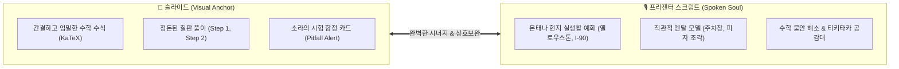

# 🏛️ MONTANA STATE UNIVERSITY — GALLATIN COLLEGE
# M090 INTRODUCTORY ALGEBRA: 슬라이드-스크립트 조화 헌장 (HARMONY PRINCIPLES)

> **문서명:** `SLIDE_SCRIPT_HARMONY_PRINCIPLES.md`  
> **기관:** Gallatin College, Montana State University (Bozeman, MT)  
> **과목:** M090 Introductory Algebra (Fall/Spring 15-Week Master Curriculum)  
> **강사진:** Prof. Eunju Park (주임 교수) • TA Sora (수석 조교 및 학생 멘토)  
> **핵심 철학:** **"슬라이드는 정돈된 시각적 닻(Anchor), 스크립트는 풍부한 실생활 예화와 생명력(Soul)"**  
> **제정일:** 2026년 10월 3일  
> **적용 대상:** Lecture 01 ~ Lecture 45 전 강의 (총 361개 슬라이드 및 영상 제작 파이프라인)

---

## 1. 🌟 제정 배경 및 대원칙 (Foundational Philosophy)

사용자의 핵심 통찰:
> **"slides에 없어도 풍부한 예화는 좋은 것입니다."**

멀티미디어 교육 공학(Dual-Coding Theory & Cognitive Load Theory)에 따르면, 학습자는 **시각적 채널(눈)**과 **청각적 채널(귀)**을 동시에 사용하여 정보를 처리할 때 가장 깊이 있게 학습합니다.

- **만약 슬라이드에 모든 설명을 다 적으면:** 화면이 글자로 빽빽해져 인지 과부하(Cognitive Overload)가 걸리고, 학생은 강의를 듣지 않고 글자 읽기에 급급해집니다.
- **만약 스크립트가 슬라이드의 글자만 그대로 읽으면:** 소위 '앵무새 낭독(Parrot Reading)'이 되어 강의가 극도로 지루해지고 학생의 주의력이 급격히 떨어집니다.

따라서 M090 강의 제작의 최상위 원칙은 **"슬라이드의 시각적 절제미"**와 **"대본의 청각적 풍부함"**이 상호보완적으로 어우러지는 **조화(Harmony)**입니다.



---

## 2. 🏛️ 조화 원칙의 3대 기둥 (The Three Pillars of Harmony)

### 기둥 1. 슬라이드는 칠판(Board)처럼 — 시각적 닻 (Visual Anchor)
1. **One Problem = One Slide:** 한 슬라이드에는 오직 하나의 핵심 아이디어 또는 문제만 배치하여 시각적 여백을 확보합니다.
2. **수학적 엄밀성:** 공식, 수식, 좌표평면 그래프, 소인수분해, 단계별 약분 과정은 한눈에 들어오도록 단정하게 KaTeX로 렌더링합니다.
3. **요약과 뼈대 중심:** 긴 줄글 설명 대신 **불릿 포인트, 표(Table), 굵은 글씨**를 사용하여 시각적 스캔이 즉각 가능하도록 만듭니다.

### 기둥 2. 스크립트는 현실 세계(Real Life)처럼 — 청각적 생명력 (Spoken Soul)
1. **풍부한 예화의 자유로운 전개:** 슬라이드 텍스트에 없는 비유(주차장 빈자리, 피자 조각, 따뜻한 커피 한 잔, 초록불 신호등)를 음성으로 과감하게 투입합니다.
2. **몬태나 로컬 감성 반영:** 보즈먼 시내, 빌링스 운전, I-90 고속도로, 옐로우스톤 국립공원, Bridger Bowl 스키장 등 학생들이 매일 보고 겪는 현지 소재를 적극 활용합니다.
3. **수학 불안(Math Anxiety) 케어:** "알파벳이 나와서 당황하셨죠?", "여기서 시험 볼 때 다들 0점 받는 실수" 등 학생의 입장을 먼저 대변하여 심리적 장벽을 허뭅니다.
4. **살아 숨쉬는 핑퐁 티키타카:** 일방적인 독백을 배제하고, [Prof. Park]의 친절한 가이드와 [TA Sora]의 날카로운 질문/정리가 8~14턴으로 빠르게 교대됩니다.

### 기둥 3. 동기화 닻 (Synchronization Anchors) — 100% 수치 일치
1. **자유로운 비유 속 엄밀한 기준점:** 비유와 이야기는 무한히 풍부하게 펼치되, 슬라이드 화면에 떠 있는 **문제 번호, 변수 기호, 단계 번호(Step 1, Step 2), 분모/분자 수치, 최종 정답**은 스크립트와 100% 일치해야 합니다.
2. **시선의 길잡이:** "슬라이드 2단계의 분모 24를 보세요", "오른쪽 함정 카드를 주목하세요"와 같이 화면의 시각 요소를 음성으로 자연스럽게 가리킵니다.

---

## 3. ⚠️ 반드시 피해야 할 3대 안티패턴 (Anti-Patterns to Avoid)

| 안티패턴 | 구체적 현상 | 문제점 | 올바른 해결책 |
| :--- | :--- | :--- | :--- |
| **1. 앵무새 낭독<br>(Parrot Reading)** | 슬라이드에 적힌 텍스트를 글자 그대로 토씨 하나 안 틀리고 읽음 | 학생이 '이미 다 읽었는데 왜 또 읽지?'라며 지루해하고 이탈함 | 슬라이드는 뼈대만 두고, 음성으로는 **"이게 일상생활에서 어떤 의미인지", "왜 이런 공식이 나왔는지"** 비유로 확장 |
| **2. 슬라이드 과밀화<br>(Text Overcrowding)** | 좋은 예화와 설명을 슬라이드에 줄글로 빽빽하게 다 집어넣음 | 슬라이드가 복잡해져서 정작 중요한 수식과 칠판 필기가 눈에 들어오지 않음 | 긴 설명은 슬라이드에서 과감히 삭제하고 **프리젠터 모드 대본(음성)으로만 전달** |
| **3. 맥락 이탈 및 데이터 오염<br>(Context Hallucination)** | 슬라이드에 없는 내용이라며, 아직 배우지도 않은 다른 단원의 내용(러시아 인형, 실수 체계 등)을 엉뚱하게 발언 | 학생이 혼란에 빠지고 강의의 흐름이 깨짐 | 예화는 풍부하게 쓰되, **반드시 현재 슬라이드의 학습 목표(분수 덧셈, $D=rt$ 등)를 설명하는 비유**여야 함 |

---

## 4. 🏆 골드 스탠다드 모범 사례 (Case Studies from Lecture 01)

### 📌 사례 1. Slide 2 — 변수와 상수의 개념 ($D = r \cdot t$)
- **슬라이드 시각 내용:**  
  $$D = r \cdot t, \quad 140 = 70 \cdot t \implies t = 2\text{ hours}$$  
  *(단정한 정의와 3단계 풀이만 수록)*
- **프리젠터 스크립트의 풍부한 예화:**  
  - **소라 조교:** *"교수님, 학생들은 알파벳이 등장하면서부터 수학이 싫어졌다고 해요!"*  
  - **소라 조교:** *"변수는 번호가 들어와 주차하길 기다리는 **'빈 주차 공간'** 같네요!"*  
  - **박은주 교수:** *"맞아요! I-90 고속도로에서는 시속 70마일로 달리지만 다운타운 보즈먼에서는 25마일로 달리죠. 속도는 변하니까 변수 $r$이지만, 140이나 70이라는 숫자는 영원히 변하지 않는 상수입니다."*
- **조화도 분석:** 슬라이드에는 없는 **'주차장 비유'**와 **'보즈먼 도로 속도차'**가 변수의 본질을 1초 만에 납득시킴.

---

### 📌 사례 2. Slide 3 — 식(Expression) vs 방정식(Equation)
- **슬라이드 시각 내용:**  
  $$3x - 5 \quad \text{vs} \quad 3x - 5 = 16$$  
  *(허용 연산 비교 표 & 허깨비 등호 경고 카드)*
- **프리젠터 스크립트의 풍부한 예화:**  
  - **박은주 교수:** *"식(Expression)은 **'따뜻한 커피 한 잔'** 같은 명사구입니다. 등호가 없으니 풀 수 없고 그냥 값만 대입할 수 있죠."*  
  - **소라 조교:** *"하지만 방정식(Equation)은 **'이 따뜻한 커피는 4달러입니다'**처럼 등호($=$)가 있는 완성된 문장이네요!"*  
  - **박은주 교수:** *"그렇죠! 등호는 양팔 저울(Balance Scale) 같아서 양쪽의 균형을 맞추는 $x=7$을 찾아낼 수 있습니다."*
- **조화도 분석:** 추상적인 수학 문법을 **'커피 한 잔'**과 **'양팔 저울'**로 시각화하여 문법적 차이를 완벽히 체화시킴.

---

### 📌 사례 3. Slide 4 — 분수 덧셈 ($\frac{1}{8} + \frac{1}{6}$)
- **슬라이드 시각 내용:**  
  $$\text{LCD}=24, \quad \dfrac{3}{24} + \dfrac{4}{24} = \dfrac{7}{24}$$
- **프리젠터 스크립트의 풍부한 예화:**  
  - **소라 조교:** *"많은 학생들이 그냥 분모끼리 더해서 $\frac{2}{14}$라고 쓰다가 시험에서 0점을 받아요!"*  
  - **박은주 교수:** *"분모는 **'피자 조각의 크기'**입니다! 8등분한 피자 조각과 6등분한 피자 조각은 크기가 다르기 때문에, 똑같은 24조각으로 잘라 맞추기(통분) 전에는 결코 합쳐서 셀 수 없습니다."*
- **조화도 분석:** 왜 귀찮게 통분을 해야 하는지를 **'피자 조각 크기'** 비유로 직관적으로 납득시킴.

---

### 📌 사례 4. Slide 9 — 분수 곱셈 ($\frac{1}{9} \cdot \frac{1}{6}$)
- **슬라이드 시각 내용:**  
  $$\text{Do we need LCD? } \mathbf{\text{NO!}} \quad \dfrac{1 \cdot 1}{9 \cdot 6} = \dfrac{1}{54}$$
- **프리젠터 스크립트의 풍부한 예화:**  
  - **소라 조교:** *"곱셈 문제인데도 학생들은 습관적으로 5분 동안 9와 6의 최소공배수를 찾느라 진땀을 빼요!"*  
  - **박은주 교수:** *"곱셈 기호($\cdot$)는 **'초록불 직진 신호등'**입니다! 통분할 필요 없이 그냥 분자는 분자끼리, 분모는 분모끼리 쭉 직진해서 곱하면 10초 만에 끝납니다."*
- **조화도 분석:** 슬라이드의 강렬한 **"NO!"**와 스크립트의 **"초록불 신호등"**이 결합하여 시험 시간 단축 노하우를 전달.

---

## 5. 🧰 단원별(Unit 1~3) 핵심 메타포 & 예화 툴킷 (Metaphor Toolkit)

앞으로 2강부터 45강까지 적용할 수 있는 표준 예화 라이브러리입니다:

```mermaid
mindmap
  root((M090 메타포 툴킷))
    Unit 1: 대수 기초 & 일차방정식
      음수 지수: 엘리베이터 티켓 (위층↔아래층 이동)
      대입법: 빈 주머니 (괄호) 법칙
      방정식: 양팔 저울의 균형 맞추기
      분수 방정식: LCD 물총으로 분모 날려버리기 (Clearing Fractions)
    Unit 2: 좌표평면 & 일차함수
      기울기: I-90 Bozeman Pass 6% 급경사 도로
      수평선과 수직선: HOY VUX 스키 슬로프 (평지 vs 절벽)
      함수: 동전을 넣으면 콜라가 나오는 자동판매기
      선형 비용 모델: Bridger Bowl 스키 패스 시즌권 vs 일일권 손익분기점
    Unit 3: 이차함수 & 포물선
      포물선 궤적: 미식축구 쿼터백의 롱패스 & 옐로우스톤 올드페이스풀 간헐천
      최고점: 공이 공중에 멈추는 찰나의 꼭짓점 (Vertex)
      인수분해: 곱해서 c가 되고 더해서 b가 되는 완벽한 짝꿍 찾기 (Matchmaking)
```

---

## 6. ✅ 강의 제작 전 슬라이드-스크립트 조화도 체크리스트

모든 강의를 비디오 렌더링하기 전, 다음 9가지 질문을 통과해야 합니다:

### 👀 1. 슬라이드 시각 점검 (Visual Check)
- [ ] 슬라이드가 "One Problem = One Slide" 규칙을 준수하여 텍스트가 시각적으로 여유로운가?
- [ ] 수식과 단계별 계산(KaTeX)이 모호함 없이 단정하게 렌더링되어 있는가?
- [ ] 소라의 시험 함정 카드(Pitfall Alert)가 명확한 경고 메시지를 담고 있는가?

### 🎙️ 2. 스크립트 예화 및 조화 점검 (Script Harmony Check)
- [ ] 스크립트가 슬라이드의 글자를 단순히 똑같이 읽는 '앵무새 낭독'에 머물러 있지 않은가?
- [ ] 슬라이드에는 없는 **직관적 비유(피자, 주차장, 저울, 엘리베이터 등)**가 1개 이상 포함되어 있는가?
- [ ] 몬태나 현지 생활(Bozeman, I-90, Bridger Bowl 등) 또는 현실 세계의 맥락이 반영되어 있는가?
- [ ] 학생의 두려움(Math Anxiety)을 공감하고 시험 실수를 예방하는 소라 조교의 팁이 살아있는가?

### 🎯 3. 동기화 엄밀성 점검 (Fidelity Check)
- [ ] 대화에서 언급하는 수치, 분수, 기호, 정답이 슬라이드 화면의 수식과 100% 일치하는가?
- [ ] 다른 단원의 엉뚱한 개념이나 잘못된 발음(예: dollar 오발음, 미배운 공식)이 전혀 없는가?

---

> **결론:**  
> **"슬라이드는 학생이 공책에 적고 시험지에 풀 엄밀한 뼈대이고, 스크립트는 그 뼈대에 살과 피를 붙여주는 따뜻한 이야기다."**  
> 이 조화 원칙을 철저히 견지할 때, M090은 미국 최고의 온라인 대수학 강의 시리즈가 될 것입니다.
