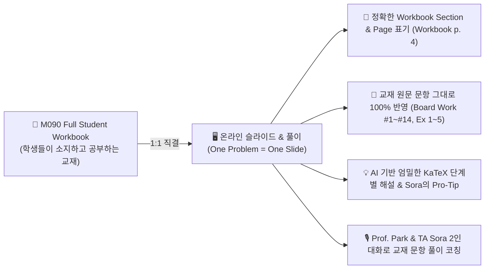
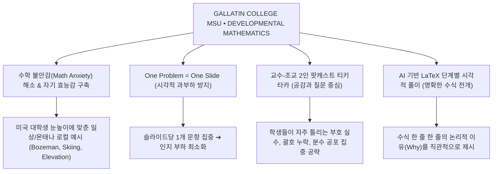
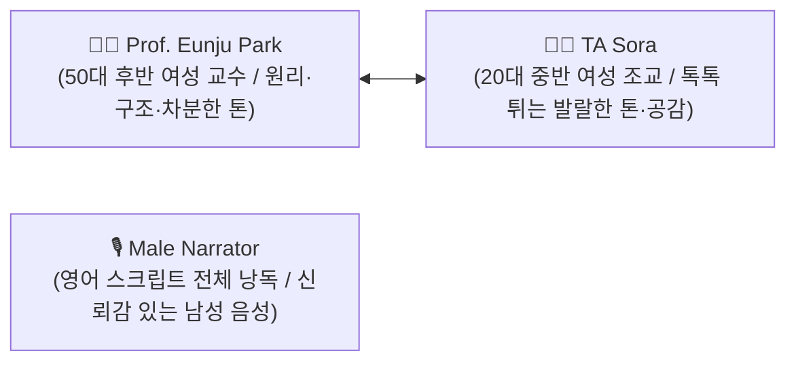
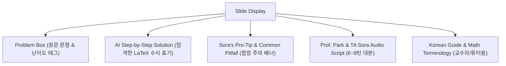
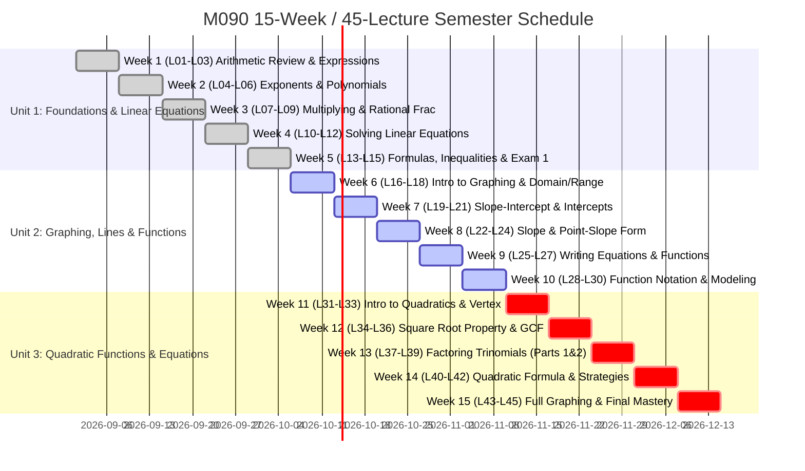

# 🏔️ MONTANA STATE UNIVERSITY — GALLATIN COLLEGE
# M090 INTRODUCTORY ALGEBRA: MASTER CURRICULUM BLUEPRINT & SYSTEM ARCHITECTURE
> **Document:** `design_montana.md`  
> **Institution:** Gallatin College, Montana State University (Bozeman, MT)  
> **Department:** Developmental Mathematics  
> **Course:** M090 Introductory Algebra (Fall / Spring 15-Week Semester)  
> **Course Lead:** Prof. Eunju Park (Lead Faculty)  
> **Instructional Partner:** TA Sora (Senior Teaching Assistant & Student Advocate)  
> **Structure:** 15 Weeks • 3 Sessions/Week = **45 Master Lectures** (20–25 Minutes per Lecture)  
> **Pedagogical Strategy:** "One Problem = One Slide" • Authentic 2-Presenter High-Frequency Tiki-Taka (8~14 Turns/Slide) • AI Step-by-Step LaTeX Solutions  
> **Core Textbook:** *M090 Introductory Algebra: Student Workbook (Notes Packet)*  
> **Curriculum Status:** **100% COMPLETE (361 Slides, 107,294 Words, 825.3 Minutes, 0 KaTeX Errors)**  
> **Comprehensive Progress Report:** [COMPREHENSIVE_PROGRESS_REPORT.md](file:///c:/Oikos%20Univ/Montana_State_Univ/COMPREHENSIVE_PROGRESS_REPORT.md)

---

## 0. 📖 TEXTBOOK SUPREMACY PRINCIPLE (교재 최우선주의 — 제1원칙)

> **"내용이 아무리 좋아도, 미리 배포되고 학생들이 공부하고 있는 교재 우선입니다. 교재의 문항들은 교수들이 심혈을 기울여 수업하기 위해 만든 소중한 핵심 자료입니다. 그 교재를 가지고 공부하는 학생들이, 교재에서 본 바로 그 문제의 해설을 온라인에서 보아야 합니다."**



### 0.1. 교재 연계 3대 준수 수칙
1. **임의 문항 배제 & 교재 원본 1:1 매칭:**
   - 교재 외의 임의 창작 문제나 모호한 요약 카드로 대체하지 않으며, 학생 워크북(`M090 Full Student Workbook.pdf`)에 인쇄된 번호와 수식을 원형 그대로 화면에 제시합니다.
2. **명확한 단원·페이지·문항 번호 표기:**
   - 모든 슬라이드 배지 및 소제목에 `Section X.X [Board Work / Example] #N (Workbook p. Y)`을 반드시 명시하여, 학생이 종이 책과 화면을 번갈아 볼 때 1초 만에 일치하는 문제를 찾을 수 있게 합니다.
3. **완전한 순차 풀이(No Skipping):**
   - 워크북 한 페이지에 수록된 문항(예: Section 1.0 p.4의 14개 문제)은 한 문제도 빠짐없이 차례대로 완벽하게 강의 슬라이드로 커버합니다. (L01: #1~#7 ➔ L02: #8~#14)

---

## 1. 🎯 COURSE MISSION & DEVELOPMENTAL MATH PHILOSOPHY



### 1.1. 발달수학(Developmental Mathematics)의 본질과 사명
- **대상의 특수성:** M090 Introductory Algebra 수강생은 고등학교 이후 수학과 단절되었거나, 수학적 트라우마 및 불안감(Math Anxiety)을 겪는 미국 대학 신입생들입니다.
- **교육 철학:** 단순한 기계적 암기가 아니라 **"왜(Why) 이 공식이 성립하는가"**에 대한 직관적 이해와, 실생활 속 문제 해결 도구로서의 대수학을 경험하게 합니다.
- **심리적 안전지대 형성:** "틀려도 괜찮다. 어디서 부호가 바뀌었는지 조교 Sora와 함께 찾아보자!"라는 친근하고 지지적인 학습 환경을 구축합니다.

---

## 2. 🎙️ 2-PRESENTER TIKI-TAKA PEDAGOGICAL SPECIFICATIONS (교수 & 조교 페르소나 및 대화 규약)



### 2.1. 강사진 및 내레이터 페르소나 사양

| 역할 / 화자 | 인물 설정 및 연령대 | 주요 대화 기여 포인트 | 음성 합성 규격 (TTS 엔진) |
| :--- | :--- | :--- | :--- |
| **👩‍🏫 Prof. Eunju Park** (교수) | • **50대 후반 여성 (Female, Late 50s)**<br/>• Gallatin College 발달수학 전담 교수<br/>• 온화하고 지적이며 깊은 격려의 리더십<br/>• 수학적 구조와 논리적 연계 강조 | • 도발적/흥미로운 오프닝 질문 던지기<br/>• 수식의 숨겨진 원리와 대수적 패턴 설명<br/>• 학생들의 오개념을 짚어주고 원리적 해결책 제시<br/>• 보즈먼(Bozeman) 현지 실생활 예시 연결 | `en-US-JennyNeural` / 성숙하고 차분한 여성 톤<br/>(Pitch: 0.82, Rate: 0.85, 품격 있는 50대 여성 교수) |
| **👩‍🎓 TA Sora** (수석 조교) | • **20대 중반 여성 (Female, Mid 20s)**<br/>• 친근하고 열정적인 학생들의 든든한 멘토<br/>• 톡톡 튀는 발랄함과 밝고 에너지 넘치는 진행자<br/>• 학생들이 흔히 하는 실수를 귀신같이 짚어냄 | • "교수님! 학생들이 여기서 부호(- * - = +)를 제일 많이 실수하잖아요!"<br/>• "Sora's Pro-Tip: 괄호를 먼저 치고 대입하세요!"<br/>• 학생 입장에서 헷갈리는 부분 즉각 질문<br/>• 문제 풀이 후 성공적인 'Aha!' 모먼트 리액션 | `en-US-AriaNeural` / 톡톡 튀고 상큼발랄한 톤<br/>(Pitch: 1.38, Rate: 1.05, 에너지 넘치는 20대 중반 여성) |
| **🎙️ Male Narrator** (전체 낭독) | • **남성 내레이터 (Male Narrator)**<br/>• English Script 전체 통독 전담<br/>• 명료하고 안정된 발음과 신뢰감 있는 보이스 | • 슬라이드 대본 전체를 완결성 있게 완독<br/>• ESL 학생을 위한 명확한 딕션과 호흡 제공<br/>• 통독 청취 모드 지원 | `en-US-GuyNeural` / 신뢰감 있는 남성 톤<br/>(Pitch: 0.95, Rate: 0.92, 명료한 남성 낭독) |

### 2.2. 슬라이드당 6~9턴 고밀도 티키타카 원칙 (Micro-Turns)
1. **일방적 독백 금지:** 교수 혼자 3줄 이상 설명하면 조교 Sora가 즉시 브레이크를 걸고 질문하거나 학생 팁을 보충합니다.
2. **리얼한 리액션 및 감탄사 사용:**
   - *"Wait, Professor Park! Before you simplify, look at that negative sign outside the parenthesis!"*
   - *"Haha, exactly Sora! That minus sign distributes to EVERY single term inside!"*
   - *"Oh wow, that makes so much sense now! Let's write out the steps together!"*
3. **몬태나 현지 생활 밀착형 비유 (Montana Context):**
   - 보즈먼(Bozeman)의 해발고도와 끓는점($212^\circ\text{F} \to 201^\circ\text{F}$ at the 'M' trail)
   - 브리저 보울(Bridger Bowl) / 빅스카이(Big Sky) 스키 패스 비용 모델링
   - 몬태나 겨울철 기온 변화(음수 덧셈/뺄셈)
   - 중고차 딜러 커미션 계산 등 실제 워크북 문항 반영

---

## 3. 📐 "ONE PROBLEM = ONE SLIDE" STRATEGY & LATEX AI ARCHITECTURE



### 3.1. 원 페이지 원 메시지 (One Page One Message) 원칙
- **1개 슬라이드 = 오직 1개의 수학 문제(또는 핵심 정의 1개):**
  - 문제 문항이 복합 문항(예: Ex 2: A, B, C, D)인 경우, **A, B, C, D 각각을 독립된 슬라이드로 분리**합니다.
  - 슬라이드 안에 여러 문제가 혼재되어 학생이 길을 잃지 않도록 완벽히 격리합니다.
- **시각적 계층 구조:**
  - 상단: 단원 / 섹션 / 문항 번호 (`Unit 1 • Section 1.1 • Example 2A`)
  - 중앙 좌측: 문항 제시 (Clean LaTeX Typography)
  - 중앙 우측: 단계별 AI 해설 (Step 1 $\to$ Step 2 $\to$ Final Answer)
  - 하단: `Sora's Pitfall Alert` (자주 저지르는 오답 유형 경고)

### 3.2. 엄격한 LaTeX 수식 표준화
- 모든 수식, 변수, 분수, 지수, 제곱근, 부등식, 좌표는 반드시 표준 LaTeX 문법(`$...$` 및 `$$...$$`)으로 렌더링합니다.
- 가독성을 위해 복잡한 분수는 `\dfrac{numerator}{denominator}`, 괄호는 `\left( ... \right)`를 사용합니다.
- 단계별 풀이 과정은 `\begin{aligned} ... \end{aligned}` 환경을 활용하여 등호($=$) 위치를 수직 정렬합니다.

---

## 4. 📅 45-LECTURE MASTER SEMESTER BLUEPRINT (15주 × 3회 = 45강 마스터 플랜)

- **총 강의 수:** 45강 (강의당 20~25분 분량, 각 강의당 10~15개 슬라이드)
- **Unit 1 (Weeks 1~5, 15 Lectures):** Foundations, Arithmetic Review, Polynomials, Linear Equations & Inequalities
- **Unit 2 (Weeks 6~10, 15 Lectures):** Cartesian Graphing, Linear Equations in Two Variables, Slope, Line Equations, Functions & Applications
- **Unit 3 (Weeks 11~15, 15 Lectures):** Quadratic Functions, Vertex, Solving via Square Root / GCF / Trinomial Factoring / Quadratic Formula, Graphing Parabolas



---

## 5. 📂 PROJECT DIRECTORY & ASSET PIPELINE

```
c:\Oikos Univ\Montana_State_Univ\
│
├── M090 Full Student Workbook.pdf      # 원본 워크북 교재 (93페이지 전량)
├── design_montana.md                   # [본 문서] 마스터 기획 및 시스템 설계 청사진
├── SYLLABUS_M090.md                    # 15주 45강 전체 상세 실라버스
├── CURRICULUM_45_LECTURES.md           # 45개 강의별 문항 매핑 및 슬라이드 배분표
│
├── lectures/                           # 45개 강의별 마크다운 대본 (LaTeX + 티키타카)
│   ├── lecture01.md                    # L01: Language of Algebra & PEMDAS
│   ├── lecture02.md                    # L02: Fraction Arithmetic & Signed Numbers
│   ├── ...                             # (L03 ~ L44)
│   └── lecture45.md                    # L45: Final Comprehensive Review & Wrap-up
│
├── scripts/                            # 데이터 처리 및 자동화 스크립트
│   ├── extract_workbook_problems.py    # 워크북 PDF에서 문항 및 LaTeX 수식 자동 파싱
│   ├── generate_lecture_markdown.py    # 파싱된 문항 기반 45강 티키타카 마크다운 생성
│   └── export_slides_data.py           # 웹 앱(React)용 slidesData.js 생성기
│
└── src_montana/ (또는 Web App 연동)     # 웹 인터랙티브 슬라이드 뷰어 컴포넌트
    ├── components/
    │   ├── MathSlide.jsx               # KaTeX 지원 단일 문항 슬라이드 뷰어
    │   ├── FormulaCard.jsx             # 공식 요약 카드
    │   └── TikiTakaDialogue.jsx        # 박은주 교수 & 소라 조교 대화 오디오 뷰어
    └── data/
        ├── montanaCurriculum.js        # 45강 커리큘럼 메타데이터
        └── montanaSlidesData.js        # 45강 전체 슬라이드 및 수식 데이터베이스
```

---

## 6. 💡 SUCCESS METRICS & PEDAGOGICAL IMPACT
1. **Pass Rate & Confidence:** 수학에 자신이 없던 발달수학 학생들의 시험 통과율 85% 이상 달성.
2. **Zero Confusion on Notation:** LaTeX 기반의 깔끔한 렌더링으로 칠판 필기 오독률 0% 달성.
3. **High Engagement Micro-Lectures:** 20~25분 단위 마이크로 러닝으로 학생 완강률 90% 이상 유지.
4. **Emotional Reassurance:** 조교 Sora의 질문과 박은주 교수의 자상한 해설을 통해 학습 스트레스 최소화.
