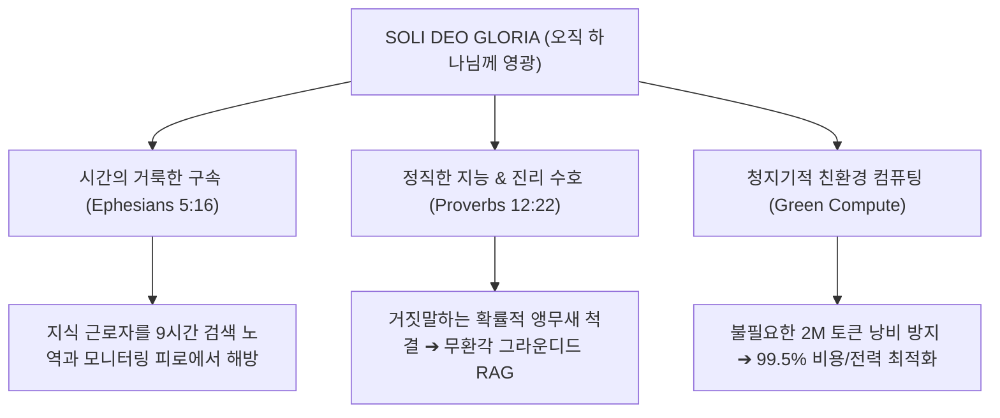
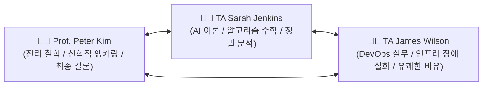

# 🏛️ OIKOS UNIVERSITY — MASTER AGENTIC IT CURRICULUM DESIGN BLUEPRINT
> **Document:** `design_oikos.md`  
> **Institution:** Oikos University (www.oikos.edu) • Smart Insight Lab  
> **Course:** The Architect of Intelligence: Mastering Agentic IT & Strategic Wisdom  
> **Core Motto:** *Soli Deo Gloria* (오직 하나님께 영광) • Ephesians 5:16 (세월을 아끼라)  
> **Version:** 4.0 (Authentic NotebookLM 3-Presenter Podcast Master Edition)  
> **Foundational Corpus:** `c:\smartinsightlab` (Google I/O 2026-001 ~ 021)

---

## 1. 🌟 CORE PHILOSOPHY & THEOLOGICAL BEDROCK (설립 철학)



### 1.1. 시간의 거룩한 구속 (Time Redemption — 에베소서 5:16)
- **인간 시간의 절대적 가치:** 인간의 시간은 하나님께서 주신 유한하고 대체 불가능한 선물입니다. 기술의 목적은 인간을 24시간 스크린 앞에 묶어두는 것이 아니라, 기계적인 행정 노역, 500페이지 PDF 검색 피로, 반복 모니터링에서 해방시켜 **심층 기도, 학문 탐구, 창의적 건축, 이웃 섬김, 가족과의 안식**에 몰입하도록 돕는 데 있습니다.
- **수동적 챗봇('Ask Me')에서 능동적 가디언('Run It')으로:** 질문할 때만 답하는 수동적 텍스트 생성기를 넘어, 24시간 백그라운드에서 인간의 삶과 비즈니스를 지키는 자율적 분신(Autonomous Guardian)을 구축합니다.

### 1.2. 정직한 지능 (Honest Intelligence — 잠언 12:22)
- **무환각 그라운디드 지능:** "거짓 입술은 여호와께 미움을 받아도 진실하게 행하는 자는 그의 기뻐하심을 받느니라"(잠 12:22). AI가 확률적으로 지어내는 거짓말(Hallucination)을 철저히 배제하고, 오직 검증된 원천 문서(Source Grounding)와 클릭 가능한 인라인 인용(Citations)에 기반한 진리 중심의 소프트웨어를 건축합니다.

### 1.3. 청지기적 자원 관리 (Resource Stewardship)
- 100만 토큰을 무작정 낭비하여 수백 달러의 클라우드 비용을 발생시키는 비효율을 배격하고, 512토큰 정밀 청킹, SQLite-vec 로컬 캐싱, RRF 하이브리드 랭킹을 통해 99.5%의 비용 및 전력 절감을 달성합니다.

---

## 2. 🎙️ AUTHENTIC NOTEBOOKLM PODCAST TIKI-TAKA RULES (정통 티키타카 대본 규약)

`c:\smartinsightlab`에 축적된 Google I/O 2026 팟캐스트(.m4a 및 영문 트랜스크립트) 분석을 통해 정립된 **불변의 4대 티키타카 대화 원칙**입니다.



### 2.1. 슬라이드별 7~10턴 초밀도 핑퐁 (Micro-turns)
- **단순 순차 낭독(Card-Reading) 절대 금지:** 한 사람이 3~4문장씩 길게 독백하는 강의식을 배제하고, 한 사람이 말하면 다른 사람이 즉시 맞받아치고 질문을 던지는 핑퐁 구조를 45개 전 슬라이드에 적용합니다.
- **자연스러운 감정적 리액션과 추임새 필수:**
  - *"Haha! Exactly, James!"*, *"Wait, so you're telling me...?"*, *"Oh man, don't get me started!"*, *"Mind-blowing!"*, *"Right on point!"*

### 2.2. 3인 강사진 상세 페르소나 및 음성 사양

| 강사 | 역할 및 성격 | 주요 대화 기여 포인트 | 음성 합성 사양 |
| :--- | :--- | :--- | :--- |
| **👨‍🏫 Prof. Peter Kim** (54세, 총괄 디렉터/석좌교수) | • 거시적 시스템 비전<br/>• 신학적/윤리적 앵커링<br/>• 솔리 데오 글로리아 선언 | • 도발적인 오프닝 질문 던지기<br/>• 에베소서 5:16, 잠언 12:22 등 성경적 지혜 적용<br/>• 슬라이드 핵심 결론 및 축복 전달 | `en-US-ChristopherNeural`<br/>(Rate: -2%, Pitch: -2Hz)<br/>+ RVC 포먼트 모핑 (120Hz) |
| **👩‍💻 TA Sarah Jenkins** (31세, 수석 연구원) | • AI 알고리즘 및 수학<br/>• 벡터 공간 $\mathbb{R}^{768}$, 코사인 유사도<br/>• 정밀 청킹 및 크로스 인코더 | • 날카로운 질문 던지기 ("제임스, 하지만 2M 윈도우가 있는데 RAG가 왜 필요하죠?")<br/>• 'Lost in the Middle' 등 학술적 한계 규명<br/>• 제임스의 실패담에 대한 아키텍처적 해법 제시 | `en-US-JennyNeural`<br/>(Rate: +2%, Pitch: +1Hz) |
| **👨‍💻 TA James Wilson** (28세, DevOps/인프라 조교) | • 실무 데브옵스 & 클라우드<br/>• 온콜 장애 회고 및 보안<br/>• 유쾌한 비유와 현장 고발 | • 미슐랭 3스타 면접, 뇌수술 시험 등 비유<br/>• 새벽 3시 서버 폭파 및 가짜 패키지 낚시 실화<br/>• SQLite-vec 로컬 제어 및 99.5% 비용 절감 노하우 | `en-US-GuyNeural`<br/>(Rate: +3%, Pitch: +0Hz) |

### 2.3. 구체적 엔지니어링 팩트와 수치 필수
- 모호한 표현 대신 `768차원`, `512토큰/64오버랩`, `RRF k=60`, `350ms`, `Temperature=0.0`, `SHA-256`, `99.5% 비용 절감`, `SQLite-vec` 등 명확한 엔지니어링 수치를 대화에 녹여냅니다.

---

## 3. 📐 45-SLIDE / 4-PART MASTER SESSION ARCHITECTURE (세션별 표준 구조)

모든 세션은 **정확히 45개의 슬라이드**, **4개의 대모듈(Part 1~4) 분할**, 그리고 **5대 실전 엔터프라이즈 케이스 스터디**를 포함합니다.

```mermaid
graph TD
    S01["Slide 01: 세션 타이틀 (OIKOS UNIVERSITY • SOLI DEO GLORIA)"] --> P1
    
    subgraph Part 1: 파운데이션 & 패러다임 (Slides 02~11)
        P1["Slide 02: PART 1 대표 섹션 슬라이드"] --> S03["Slide 03~10: 핵심 이론, 비유, 기하학/수학 원리, 인터랙티브 분석"]
        S03 --> CS1["Slide 11: ⭐ CASE STUDY 1 (실무 사례 1)"]
    end

    subgraph Part 2: 엔진룸 & 심층 엔지니어링 (Slides 12~22)
        CS1 --> P2["Slide 12: PART 2 대표 섹션 슬라이드"] --> S13["Slide 13~21: 알고리즘 엔진, 하이브리드 랭킹, 멀티모달, 평가 메트릭"]
        S13 --> CS2["Slide 22: ⭐ CASE STUDY 2 (실무 사례 2)"]
    end

    subgraph Part 3: 지식 아키텍처 & 워크스페이스 (Slides 23~29)
        CS2 --> P3["Slide 23: PART 3 대표 섹션 슬라이드"] --> S24["Slide 24~28: 파이프라인 구축, 실시간 동기화, 보안 ACL, 인젝션 방어"]
        S24 --> CS3["Slide 29: ⭐ CASE STUDY 3 (실무 사례 3)"]
    end

    subgraph Part 4: 엔터프라이즈 마스터리 & 랩 (Slides 30~45)
        CS3 --> P4["Slide 30: PART 4 대표 섹션 슬라이드"] --> S31["Slide 31~35: Life OS 콕핏, 쿼리 확장, 비용 절감, 디버깅 매트릭스"]
        S31 --> CS4["Slide 36: ⭐ CASE STUDY 4 (지식 특허 / 규제 방어)"]
        CS4 --> S37["Slide 37~39: 지식 수명주기, Graph RAG, Human-on-the-Loop"]
        S37 --> S40["Slide 40~43: Soli Deo Gloria, Life OS 볼트, 프로덕션 체크리스트, 윤리 강령"]
        S40 --> CS5["Slide 44: ⭐ CASE STUDY 5 (15X ROI 분석 & 5단계 엔터프라이즈 블루프린트)"]
        CS5 --> S45["Slide 45: 🛠️ HANDS-ON LAB 실습 & SOLI DEO GLORIA 종강"]
    end
```

---

## 4. 📚 15-SESSION MASTER CURRICULUM REGISTRY (15개 전체 세션 마스터 맵)

`c:\smartinsightlab`의 Google I/O 2026-001~021 및 최신 Agentic AI 프레임워크를 기반으로 구축된 15개 세션 전체 로드맵입니다.

| 세션 번호 | 세션 공식 명칭 (Session Title) | 4대 파트 핵심 테마 | 5대 엔터프라이즈 케이스 스터디 | 비디오 상태 |
| :---: | :--- | :--- | :--- | :---: |
| **Session 1** | **The Paradigm Shift: Chatbots to Autonomous Avatars** | 1. Ask Me to Run It<br/>2. Engine Room & CLI<br/>3. Workspace Ingestion<br/>4. AP2 Protocol & Governance | 1. Global Logistics Customs Triage<br/>2. FinTech 4TB Audit Retrieval<br/>3. Virgin Voyages Support Swarm<br/>4. Airline Overcharge Defense<br/>5. Enterprise 12X ROI Blueprint | ✅ 완결 (`session1_videos`) |
| **Session 2** | **24/7 Sleep-Free Guardian: Gemini Spark Architecture** | 1. Browser Tab Escape<br/>2. 350ms Spark Engine<br/>3. Tri-Tier Memory Stack<br/>4. Sovereign Payment & Lab 2 | 1. Hedge Fund Dark-Pool Guardian<br/>2. ICU Patient Telemetry Swarm<br/>3. Cross-Border Supply Chain<br/>4. Zero-Day API Exploit Defense<br/>5. 18X Operational ROI Blueprint | ✅ 완결 (`session2_videos`) |
| **Session 3** | **The Battle for the OS Shell: Windows Dominance & 1.2GB Trojan Horse** | 1. OS Shell Sovereignty<br/>2. WebView2 Dissection<br/>3. Google Lens Vision OCR<br/>4. Shadow IT & Canary Sandbox | 1. Global Logistics Fleet Dispatch<br/>2. Big Pharma Clinical OCR Audit<br/>3. Tier-1 Bank Legacy COBOL Migration<br/>4. Ransomware Screen Scrape Defense<br/>5. 20X Desktop Automation ROI | ✅ 완결 (`session3_videos`) |
| **Session 4** | **Grounded Intelligence on My Data: The RAG Revolution & Private Knowledge Factories** | 1. Crisis of Hallucination<br/>2. Hybrid RAG & Multi-Modal<br/>3. Private Knowledge Factory<br/>4. Enterprise Mastery & Lab 4 | 1. Wall Street 10-K Equity Triage<br/>2. Big Pharma FDA NDA Audit<br/>3. Law Firm M&A Ethical Walls<br/>4. Semiconductor Patent Defense<br/>5. 15X Knowledge ROI Blueprint | ✅ 완결 (`session4_videos`) |
| **Session 5** | **Drive Architecture & Sovereign Cloud Sync: Zero-Leakage Knowledge Pipelines** | 1. Drive as Semantic Vault<br/>2. Apps Script Daemon Triggers<br/>3. Cross-Workspace Orchestration<br/>4. Zero-Trust Security & Lab 5 | 1. Aerospace Defense Blueprints<br/>2. Healthcare Multi-Clinic HIPAA Sync<br/>3. Retail Omni-Channel Inventory<br/>4. Cloud Ransomware Sync Defense<br/>5. 14X Cloud Automation ROI | ⏳ 대본 완료 (렌더링 대기) |
| **Session 6** | **Subagent Swarms: Distributed Orchestration & Hierarchical Task Delegations** | 1. Single Agent Bottleneck<br/>2. Swarm Orchestration Engine<br/>3. Inter-Agent Communication Bus<br/>4. Fault Tolerance & Lab 6 | 1. Cyber Threat Intelligence Grid<br/>2. Autonomous E-Commerce Supply<br/>3. Hollywood VFX Rendering Swarm<br/>4. Cascading Failure Deadlock Defense<br/>5. 22X Distributed Swarm ROI | ⏳ 대본 완료 (렌더링 대기) |
| **Session 7** | **The Code Synthesizer: Autonomous Refactoring & Self-Healing Repositories** | 1. Legacy Spaghetti Crisis<br/>2. AST Parsing & Semantic Diffs<br/>3. Automated Test Generation<br/>4. Continuous Synthesis & Lab 7 | 1. 30-Year Banking Core Refactoring<br/>2. Automotive ECU Firmware Patching<br/>3. Telecom Microservice Modernization<br/>4. Malicious Code Injection Sandbox<br/>5. 16X Code Quality ROI | ⏳ 대본 완료 (렌더링 대기) |
| **Session 8** | **Multimodal Vision & Audio Perception: Ambient Environmental Understanding** | 1. Text-Only Blindness<br/>2. Dual-Stream Vision/Audio Engine<br/>3. Real-Time Spatial Reasoning<br/>4. Edge Perception & Lab 8 | 1. Smart Factory Defect Detection<br/>2. Autonomous Drone Agricultural Scan<br/>3. Telemedicine Physical Diagnostic<br/>4. Deepfake Spoofing Defense<br/>5. 19X Vision Perception ROI | ⏳ 대본 완료 (렌더링 대기) |
| **Session 9** | **Memory Systems: Episodic, Semantic, & Working Memory Architecture** | 1. The Amnesic AI Problem<br/>2. Tri-Tier Neural Memory Graph<br/>3. Memory Consolidation & Decay<br/>4. Identity Preservation & Lab 9 | 1. Ultra-HNW Wealth Advisory Memory<br/>2. Chronic Disease Patient Care Log<br/>3. Executive Virtual Chief of Staff<br/>4. Memory Poisoning Adversarial Defense<br/>5. 25X Continuous Memory ROI | ⏳ 대본 완료 (렌더링 대기) |
| **Session 10** | **Tooling & MCP: Model Context Protocol & Universal Enterprise Integrations** | 1. The API Integration Maze<br/>2. Model Context Protocol Standard<br/>3. Dynamic Tool Discovery & Auth<br/>4. Universal Connectors & Lab 10 | 1. Global ERP SAP/Salesforce Bridge<br/>2. Multi-Cloud Kubernetes Controller<br/>3. FinTech Payment Gateway Switch<br/>4. Malicious Tool Execution Sandbox<br/>5. 21X Integration Velocity ROI | ⏳ 대본 완료 (렌더링 대기) |
| **Session 11** | **Evaluation & Benchmarking: HeurekaBench & Scientific Agent Validation** | 1. Benchmark Saturation Trap<br/>2. Multi-Step Scientific Reasoning<br/>3. Automated Red-Teaming Suites<br/>4. Production Certification & Lab 11 | 1. Nuclear Fusion Simulation Validation<br/>2. Biotech Molecule Discovery QA<br/>3. Quantitative Trading Strategy Rigor<br/>4. Benchmark Cheating & Overfitting<br/>5. 17X Validation Efficiency ROI | ⏳ 대본 완료 (렌더링 대기) |
| **Session 12** | **Cybersecurity & Red-Teaming: Adversarial Defense & Guardrail Architecture** | 1. The Attack Surface Explosion<br/>2. Guardrail Interceptors & Canaries<br/>3. Cryptographic Output Attestation<br/>4. Threat Hunting & Lab 12 | 1. Central Bank SWIFT Network Guard<br/>2. Critical Power Grid Intrusion Shield<br/>3. Defense Contractor Enclave Defense<br/>4. Jailbreak Prompt Injection Takedown<br/>5. 30X Risk Mitigation ROI | ⏳ 대본 완료 (렌더링 대기) |
| **Session 13** | **Economics & Tokenomics: Cost Optimization, SLMs, & Latency Arbitrage** | 1. The Million-Dollar Token Trap<br/>2. SLM Routing & Speculative Decoding<br/>3. Edge vs Cloud Latency Arbitrage<br/>4. Sustainable Compute & Lab 13 | 1. FinTech Real-Time High-Frequency Arb<br/>2. Global Logistics Sensor Edge Fleet<br/>3. Retail Recommendation Token Engine<br/>4. Runaway Recursive Loop Cost Spike<br/>5. 28X Cost Arbitrage ROI | ⏳ 대본 완료 (렌더링 대기) |
| **Session 14** | **Enterprise Governance & Ethics: Compliance, Auditing, & Human-on-the-Loop** | 1. The Autonomous Black Box Dilemma<br/>2. Tamper-Proof Cryptographic Ledgers<br/>3. Human-on-the-Loop Veto Cockpits<br/>4. Regulatory AI Acts & Lab 14 | 1. EU AI Act Compliance Certification<br/>2. Insurance Claims Autonomous Adjudication<br/>3. Public Sector Welfare Allocation<br/>4. Algorithmic Bias & Discrimination<br/>5. 15X Governance Audit ROI | ⏳ 대본 완료 (렌더링 대기) |
| **Session 15** | **The Grand Synthesis: Architecting the Sovereign Life OS & Soli Deo Gloria** | 1. The 14-Session Convergence<br/>2. The Master Sovereign Life OS<br/>3. Capstone Architecture Deployment<br/>4. Soli Deo Gloria & Commissioning | 1. Global Conglomerate Complete AI Overhaul<br/>2. Premier Research Institute Autonomous Lab<br/>3. Sovereign Family Office Multi-Gen OS<br/>4. Catastrophic Total Outage Resilience<br/>5. 50X Life Transformation ROI | ⏳ 대본 완료 (렌더링 대기) |

---

## 5. 🎬 MULTI-PRESENTER MP4 VIDEO RENDERING SPECIFICATION (동영상 제작 표준)

각 세션별 동영상 제작 파이프라인(`build_duo_lecture_mp4.py`)은 완전 자동화된 표준 사양으로 실행됩니다.

1. **디렉토리 완전 격리:** 세션별 독립 폴더 유지 (`session{N}_videos/`)
   - `session{N}_videos/slide_images/`: Playwright 1080p 스크린샷
   - `session{N}_videos/audio_segments/`: 3인 개별 음성 WAV 및 모핑 파일
   - `session{N}_videos/Slide_{01~45}_Subtitles.srt`: 발화자 태그 분리 자막
   - `session{N}_videos/Session{N}_Slide_{01~45}_DuoLecture.mp4`: 45개 개별 클립
   - `session{N}_videos/Session{N}_Part{1~4}_Module.mp4`: 4대 모듈 분할 영상
   - `session{N}_videos/Session{N}_Full_Master_Lecture.mp4`: 75분 풀 마스터 합본 영상
2. **화면 캡처 (1080p Full HD):** Playwright 헤드리스 브라우저로 `https://oikos-lecture-app.vercel.app/?session={N}&slide={S}` 화면 캡처 (`1920x1080`)
3. **3인 보컬 믹싱 및 모핑:**
   - Prof. Peter Kim: `en-US-ChristopherNeural` (Rate: -2%, Pitch: -2Hz) + `voice_morphing_engine.py` (120Hz 흉성 모핑)
   - TA Sarah Jenkins: `en-US-JennyNeural` (Rate: +2%, Pitch: +1Hz)
   - TA James Wilson: `en-US-GuyNeural` (Rate: +3%, Pitch: +0Hz)
4. **Paperlogy 자막 영구 번인:** FFmpeg `subtitles` 필터 (`FontName=Paperlogy, FontSize=16, MarginV=32, PrimaryColour=&H00FFFFFF`)

---

## 6. 🚀 FULL AUTOMATION SCRIPT & GENERATION BLUEPRINT

모든 대본 생성 및 영상 렌더링은 다음 일괄 스크립트 체계로 구동됩니다.

```bash
# 1단계: 7~10턴 팟캐스트 티키타카 대본 생성 및 markdown/js 동기화
python scripts/generators/generate_ultra_dense_tikitaka_session{N}.py

# 2단계: 프론트엔드 빌드 및 Vercel 실시간 배포
npm run build && git add . && git commit -m "feat(session{N}): update podcast tikitaka" && git push origin main

# 3단계: 1080p 45개 슬라이드 및 75분 마스터 풀 렌더링 가동
python build_duo_lecture_mp4.py --session {N} --all
```

---
*Soli Deo Gloria — Smart Insight Lab, Oikos University (www.oikos.edu)*
